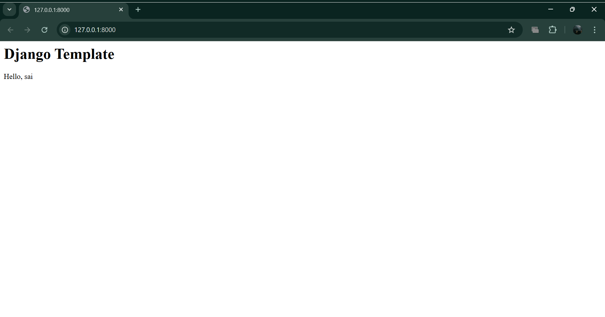

# DAY 11 WORK 
### Today we have learned how to use jinja template and django-template
First we have installed jinja using django manage.py -> uv pip install jinja2
1. create a project called jinja and an app as demo
2. In the project create jinja2.py 
jinja/jinja2.py

from jinja2 import Environment

def environment(**options):
    env = Environment(**options)
    return env

3. in settings.py we need to create a template for jinja

TEMPLATES = [
# Django Template Engine (Required for Admin)
{
    "BACKEND": "django.template.backends.django.DjangoTemplates",
    "DIRS": [BASE_DIR / "template-django"],
    "APP_DIRS": True,
    "OPTIONS": {
        "context_processors": [
            "django.template.context_processors.debug",
            "django.template.context_processors.request",
            "django.contrib.auth.context_processors.auth",
            "django.contrib.messages.context_processors.messages",
        ],
    },
},

#Jinja2 Template Engine
{
    "BACKEND": "django.template.backends.jinja2.Jinja2",
    "DIRS": [BASE_DIR / "template-jinja"],
    "APP_DIRS": True,
    "OPTIONS": {
        "environment": "jinja.jinja2.environment",
    },
},
]

4. jinja/urls.py

from django.contrib import admin
from django.urls import path, include
urlpatterns = [
    path('admin/', admin.site.urls),
    path("",include("demo.urls")),
]

5. jinja/django-template/index.html

<h1> Django Template </h1>

Hello, {{ name}} 

6. jinja/template-jinja/info.jinja

<h1>Jinja2 Template</h1>

Welcome, {{ name }}

6. demo/views.py

from django.shortcuts import render
# Create your views here.
def index(request):
    return render(request, "index.html", {"name": "sai"})

def jinja_page(request):
    return render(request, "info.jinja", {"name": "Hemanth"})

7. demo/urls.py

from django.urls import include, path
from . import views
urlpatterns = [
    # path("admin/", admin.site.urls),
    path('',views.index,name = "index"),
    path('jinja',views.jinja_page, name = "jinja"),
]

that's it now

#### What is jijna and difference between django-template vs jinja-template

## Jinja vs Django Templates - Conceptual Understanding**

### What is Jinja?**
Jinja (often misspelled as "Dinja") is a standalone templating engine - think of it as a specialized "language translator" that converts template code into final HTML. It's not tied to any specific framework and can be used with Flask, Pyramid, or even Django.

---

## Core Philosophy Comparison**

### Django Templates
- Philosophy: "Templates should limit logic"
- Designed to separate presentation from business logic strictly
- Deliberately restricts complex operations in templates
- Encourages moving logic to views/models
- **Like a** "controlled markup language" with basic programming constructs

### Jinja Templates
- Philosophy: "Templates should be expressive"
- Allows more programming-like constructs
- Gives template designers more power and flexibility
- Less restrictive about mixing logic with presentation
- Like a "Python-like language for HTML generation"

---

## Practical Metaphor

Django Templates are like training wheels or a strict recipe:
- You follow specific rules
- Certain advanced "moves" aren't allowed
- Forces good separation of concerns
- Safer for beginners/teams

Jinja is like a professional chef's kitchen:
- More tools available
- More flexibility in how you combine ingredients
- Requires more discipline to avoid messy templates
- More powerful for complex presentations

---

## When to Choose Which?

### Use Django Templates when:
- You're working within Django ecosystem
- Team includes designers with minimal programming experience
- Want to enforce clean separation of concerns
- Need Django's built-in template features (like template inheritance with ``)

### Use Jinja when:
- You need complex logic in templates
- Working with Flask or other non-Django frameworks
- Template designers are comfortable with programming concepts
- Need better performance (Jinja is generally faster)
- Want more flexible syntax and filters

---

## Key Insight
Think of it as:  
Django Templates = "What you see is what you get" with guardrails  
Jinja = "Express what you need" with more freedom but more responsibility

Both ultimately serve the same purpose: dynamically generating HTML, but with different philosophies about how much programming logic belongs in the presentation layer.
