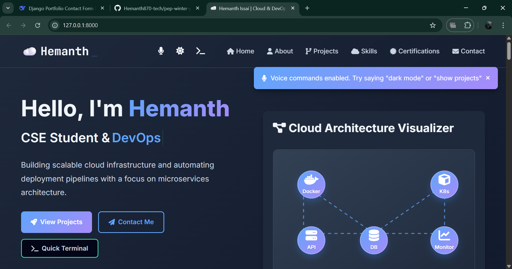
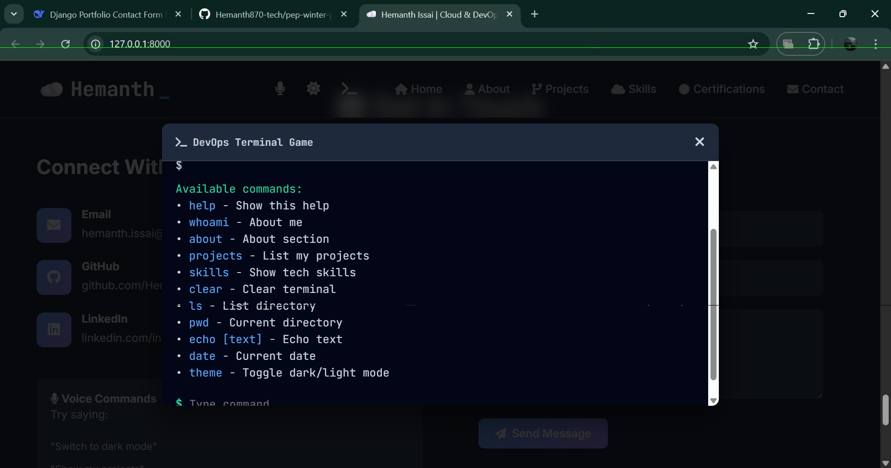
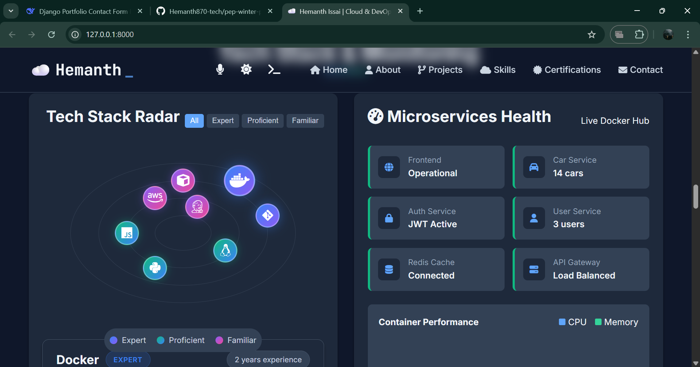
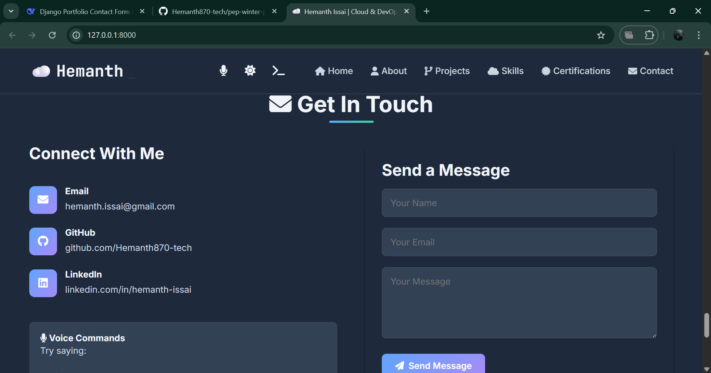
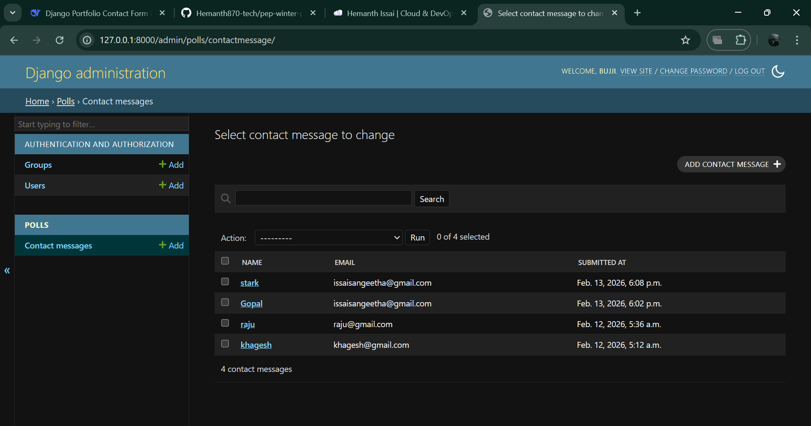
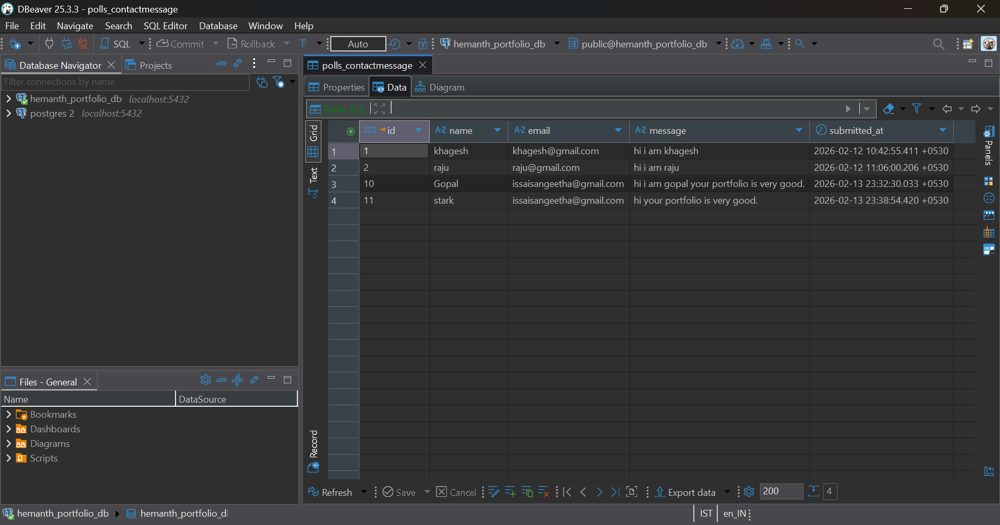
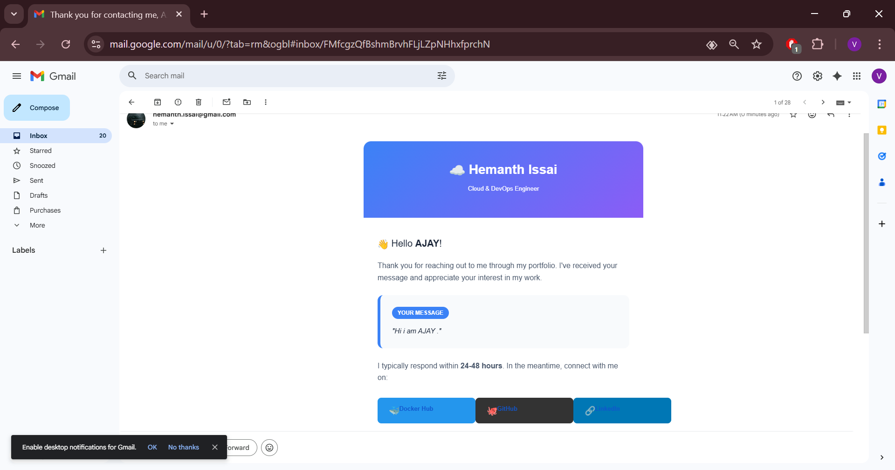

# THESE 5 DAYS I HAVE WORKED ON MY PORTFOLIO WHICH CONSIST OF THE THINGS THAT I HAVE LEARNT UPTO KNOW AND ON GOING.

# 🚀 Hemanth's DevOps Portfolio

A **feature-rich, interactive portfolio website** built with **Django** backend and modern **JavaScript** frontend, showcasing cloud engineering, DevOps practices, and Docker projects.

)

---

## 📋 TABLE OF CONTENTS
- [Project Overview](#project-overview)
- [Tech Stack](#tech-stack)
- [Key Features](#key-features)
- [Architecture](#architecture)
- [Backend System](#backend-system)
- [Frontend Features](#frontend-features)
- [Docker Integration](#docker-integration)
- [Email Automation](#email-automation)
- [Database](#database)
- [Installation](#installation)
- [Usage Guide](#usage-guide)
- [Project Structure](#project-structure)
- [Future Enhancements](#future-enhancements)

---

## 🎯 **PROJECT OVERVIEW**

This portfolio is not just a static website - it's a **fully interactive DevOps playground** that demonstrates my skills in:

- **Cloud Architecture** visualization
- **Microservices** concepts
- **Docker** containerization (with live projects!)
- **CI/CD** pipelines
- **Voice-controlled** navigation
- **Terminal-based** interaction
- **Automated email** responses

The project evolved from a simple HTML/CSS static page to a **full-stack Django application** with PostgreSQL database, real-time interactive features, and Docker Hub integration.

---

## 🛠️ **TECH STACK**

### **Backend**
| Technology | Purpose |
|------------|---------|
| **Django 6.0.1** | Web framework |
| **PostgreSQL** | Production database |
| **SQLite** | Development database |
| **python-decouple** | Environment variables |
| **SMTP (Gmail)** | Email automation |

### **Frontend**
| Technology | Purpose |
|------------|---------|
| **HTML5** | Structure |
| **CSS3** | Styling with variables |
| **JavaScript (Vanilla)** | All interactivity |
| **Font Awesome** | Icons |
| **Google Fonts** | Typography |

### **DevOps & Tools**
| Technology | Purpose |
|------------|---------|
| **Docker** | Containerization |
| **Docker Hub** | Public image registry |
| **Git/GitHub** | Version control |
| **Web Speech API** | Voice recognition |
| **WSL2** | Development environment |

---

## ✨ **KEY FEATURES**

### **1. Interactive Cloud Architecture Visualizer**
- **Visual representation** of 5 cloud services (Docker, K8s, DB, API, Monitoring)
- **Click on any service** to see real-time information
- **Toggle between** Microservices and Monolithic views
- **Live stats** showing container counts and status
- **Custom info panel** with your actual Docker project details (97+ pulls!)

### **2. Tech Stack Radar**
- **Visual skill matrix** showing expertise levels
- **Filter by level** (Expert/Proficient/Familiar)
- **Click any skill** to see detailed information
- **Dynamic info panel** below the radar
- **Real data** based on your actual projects

### **3. Microservices Health Dashboard**
- **6 microservices** from your Cars Database project
- **Real-time status** indicators
- **Service-specific metrics** (14 cars, 3 users, JWT active, etc.)
- **Docker Hub activity** tracking
- **Performance charts** (mock but realistic)

### **4. DevOps Terminal Game**
- **Fully functional terminal** in the browser
- **10+ commands** to interact with
- **Voice command support**
- **Learn about me** through CLI
- **Docker pull commands** built-in

### **5. Voice Control System**
- **Speech recognition** for hands-free navigation
- **Commands** for theme switching, section navigation
- **Voice feedback** with text-to-speech
- **Command list** accessible via "help"
- **Works in real-time**

### **6. Docker Hub Integration**
- **Live buttons** to your Docker Hub repositories
- **Pull counts** displayed (97+ for microservices-cars)
- **One-click access** to your images
- **Direct links** to microservices and monolithic projects
- **Footer integration** with Docker Hub icon

### **7. Automated Email System**
- **Instant auto-reply** when contact form is submitted
- **Professional HTML email** with:
  - Thank you message
  - Copy of their message
  - **3 social buttons** (Docker Hub, GitHub, LinkedIn)
  - Professional signature
- **Plain text fallback**
- **Database storage** of all messages
- **Admin interface** to view submissions

### **8. Dark/Light Theme Toggle**
- **System preference** detection
- **Persistent storage** in localStorage
- **Smooth transitions**
- **Complete CSS variable system**
- **Accessible contrast ratios**

### **9. Responsive Design**
- **Mobile-first approach**
- **Adapts** to all screen sizes
- **Touch-friendly** buttons
- **Collapsible navigation**
- **Optimized** for tablets and phones

### **10. Project Showcase**
- **3 live projects** with descriptions
- **GitHub links** for all repos
- **Docker Hub buttons** for containerized projects
- **Architecture diagrams** modals
- **Tech tags** for each project

---

## 🏗️ **ARCHITECTURE**

```
┌─────────────────────────────────────────────────────────────┐
│                     CLIENT BROWSER                          │
│  ┌──────────┐ ┌──────────┐ ┌──────────┐ ┌──────────┐      │
│  │   HTML   │ │   CSS    │ │    JS    │ │  Voice   │      │
│  │  Structure││  Styling │ │Interactive│ │   API    │      │
│  └──────────┘ └──────────┘ └──────────┘ └──────────┘      │
└─────────────────────────┬───────────────────────────────────┘
                          │ HTTP/HTTPS
                          ▼
┌─────────────────────────────────────────────────────────────┐
│                      DJANGO BACKEND                          │
│  ┌──────────────────────────────────────────────────────┐   │
│  │                     URL Router                        │   │
│  │  ┌──────────┐ ┌──────────┐ ┌──────────┐             │   │
│  │  │   Home   │ │  About   │ │ Contact  │             │   │
│  │  │   View   │ │   View   │ │   View   │             │   │
│  │  └──────────┘ └──────────┘ └──────────┘             │   │
│  └──────────────────────────────────────────────────────┘   │
│                                                              │
│  ┌──────────────────────────────────────────────────────┐   │
│  │                    Models                             │   │
│  │  ┌────────────────────────────────────┐              │   │
│  │  │      ContactMessage                 │              │   │
│  │  │  • name (CharField)                  │              │   │
│  │  │  • email (EmailField)                 │              │   │
│  │  │  • message (TextField)                │              │   │
│  │  │  • submitted_at (DateTimeField)       │              │   │
│  │  └────────────────────────────────────┘              │   │
│  └──────────────────────────────────────────────────────┘   │
│                                                              │
│  ┌──────────────────────────────────────────────────────┐   │
│  │                   Email System                         │   │
│  │  ┌──────────────┐     ┌──────────────┐               │   │
│  │  │  Form Submit │────▶│ Auto-Reply   │──────────────┐│   │
│  │  └──────────────┘     │   to User    │              ││   │
│  │                       └──────────────┘              ││   │
│  │                              │                       ││   │
│  │                              ▼                       ││   │
│  │                       ┌──────────────┐              ││   │
│  │                       │   SMTP       │              ││   │
│  │                       │   Gmail      │◀─────────────┘│   │
│  │                       └──────────────┘               │   │
│  └──────────────────────────────────────────────────────┘   │
│                                                              │
│  ┌──────────────────────────────────────────────────────┐   │
│  │                    Database                            │   │
│  │         ┌────────────────────────────┐                │   │
│  │         │      PostgreSQL/SQLite     │                │   │
│  │         │  • polls_contactmessage    │                │   │
│  │         │  • auth_user                │                │   │
│  │         │  • django_admin_log         │                │   │
│  │         └────────────────────────────┘                │   │
│  └──────────────────────────────────────────────────────┘   │
└─────────────────────────────────────────────────────────────┘
                          │
                          ▼
┌─────────────────────────────────────────────────────────────┐
│                     EXTERNAL SERVICES                        │
│  ┌──────────────┐    ┌──────────────┐    ┌──────────────┐   │
│  │  Docker Hub  │    │    GitHub    │    │   LinkedIn   │   │
│  │  heamnth345/ │    │ Hemanth870-  │    │ hemanth-issai│   │
│  │  microservices│    │    tech      │    │              │   │
│  └──────────────┘    └──────────────┘    └──────────────┘   │
└─────────────────────────────────────────────────────────────┘
```

---

## 🔧 **BACKEND SYSTEM**

### **Django Models**
```python
class ContactMessage(models.Model):
    name = models.CharField(max_length=100)
    email = models.EmailField()
    message = models.TextField()
    submitted_at = models.DateTimeField(auto_now_add=True)
    
    def __str__(self):
        return f"{self.name} - {self.email}"
```

### **Email Flow**
1. **User submits** contact form
2. **Data saved** to PostgreSQL database
3. **Email triggered** using Django's `send_mail()`
4. **HTML email** generated with:
   - User's name and message
   - 3 social buttons
   - Professional signature
5. **Plain text fallback** for email clients
6. **Success response** sent back to frontend

### **Environment Variables** (`.env`)
```env
EMAIL_HOST_USER=hemanth.issai@gmail.com
EMAIL_HOST_PASSWORD=xxxx xxxx xxxx xxxx  # Gmail App Password
DEFAULT_FROM_EMAIL=hemanth.issai@gmail.com
```

### **Database Configuration**
```python
# Development (SQLite)
DATABASES = {
    'default': {
        'ENGINE': 'django.db.backends.sqlite3',
        'NAME': BASE_DIR / 'db.sqlite3',
    }
}

# Production (PostgreSQL)
DATABASES = {
    'default': {
        'ENGINE': 'django.db.backends.postgresql',
        'NAME': 'hemanth_portfolio_db',
        'USER': 'hemanth_portfolio_user',
        'PASSWORD': '***',
        'HOST': 'localhost',
        'PORT': '5432',
    }
}
```

---

## 🎨 **FRONTEND FEATURES - HOW THEY WORK**

### **1. Cloud Architecture Visualizer**
```javascript
// Service details object with YOUR real data
const serviceDetails = {
    docker: {
        name: "🐳 Docker Container",
        desc: "My microservices-cars project is live with 97+ pulls!",
        status: "97+ pulls",
        containers: 6
    },
    // ... other services
};

// Click handler updates info panel
cloudServices.forEach(service => {
    service.addEventListener('click', () => {
        // Update serviceName, serviceDesc, etc.
        // Visual feedback with scale transform
    });
});
```

### **2. Voice Control System**
- Uses **Web Speech API** (`SpeechRecognition`)
- Continuous listening mode
- Command matching with keyword detection
- Text-to-speech feedback
- 15+ voice commands supported

### **3. Terminal Game**
- **Command parser** with switch statements
- **Dynamic DOM manipulation** for output
- **Command history** tracking
- **Special commands** for Docker pulls
- **Theme toggle** integration

### **4. Dark/Light Theme**
- **CSS custom properties** (variables)
- **Class toggling** on body
- **localStorage** for persistence
- **System preference** detection

---

## 🐳 **DOCKER INTEGRATION**

### **How Docker Data is Displayed**
- **Project cards** have direct Docker Hub buttons
- **Pull counts** shown in architecture visualizer
- **Deployments section** shows recent activity
- **Terminal commands** for one-click pulls
- **Footer icon** links to Docker Hub profile

---

## 📧 **EMAIL AUTOMATION DETAILS**

### **Email Template Features**
| Element | Description |
|---------|-------------|
| **Personalized greeting** | Uses user's name |
| **Message echo** | Shows their original message |
| **3 Social Buttons** | Docker Hub, GitHub, LinkedIn |
| **Brand colors** | Each platform's official color |
| **Hover effects** | Buttons lift on hover |
| **Footer links** | All platforms listed |
| **Signature** | Professional closing |

### **Email Flow Diagram**
```
┌─────────┐     ┌─────────┐     ┌─────────┐     ┌─────────┐
│  User   │────▶│ Django  │────▶│Database │────▶│  Admin  │
│Submit   │     │ View    │     │  Save   │     │  View   │
└─────────┘     └─────────┘     └─────────┘     └─────────┘
                    │
                    ▼
              ┌─────────┐     ┌─────────┐
              │  SMTP   │────▶│  User   │
              │  Gmail  │     │ Inbox   │
              └─────────┘     └─────────┘
```

### **Error Handling**
- **try-except** block catches email failures
- **Email status** tracked in response
- **User still notified** of successful form submission
- **Admin can see** failed emails in logs

---

### 💾 **DATABASE SCHEMA**

```sql
-- Contact messages table
CREATE TABLE "polls_contactmessage" (
    "id" integer NOT NULL PRIMARY KEY AUTOINCREMENT,
    "name" varchar(100) NOT NULL,
    "email" varchar(254) NOT NULL,
    "message" text NOT NULL,
    "submitted_at" datetime NOT NULL
);

-- Django admin tables
-- auth_user, auth_group, django_admin_log, etc.
```

---

### 📦 **INSTALLATION**


 1. Create virtual environment
python -m venv venv
source venv/bin/activate  # On Windows: venv\Scripts\activate

 2. Install dependencies
pip install -r requirements.txt

 4. Create .env file
echo "EMAIL_HOST_USER=hemanth.issai@gmail.com" > .env
echo "EMAIL_HOST_PASSWORD=your-app-password" >> .env
echo "DEFAULT_FROM_EMAIL=hemanth.issai@gmail.com" >> .env

 5. Run migrations
python manage.py migrate

 6. Create superuser
python manage.py createsuperuser

 7. Run development server
python manage.py runserver

# PROJECT STRUCTURE MAINLY ROLED FILES.

my-profile/
├── manage.py
├── .env                          # Environment variables
├── .gitignore                     # Git ignore file
├── requirements.txt               # Python dependencies
├── db.sqlite3                     # Development database
│
├── portfolio/                      # Django project
│   ├── __init__.py
│   ├── settings.py                 # All settings
│   ├── urls.py                     # Main URL config
│   └── views.py                    # Page views
│
├── polls/                          # Main app
│   ├── __init__.py
│   ├── admin.py                    # Admin interface
│   ├── models.py                    # ContactMessage model
│   ├── views.py                     # Contact form logic
│   ├── urls.py                      # App URLs
│   └── migrations/                   # Database migrations
│
├── static/                          # Static files
│   ├── css/
│   │   └── style.css                 # Complete styling
│   └── js/
│       └── script.js                  # All interactivity
│
└── templates/                        # HTML templates
    └── portfolio.html                  # Main page

## 🚀 **FUTURE ENHANCEMENTS**

- [ ] **Real Docker stats** - Live container metrics via Docker API
- [ ] **CI/CD pipeline** - Auto-deploy on GitHub push
- [ ] **Blog section** - Technical articles
- [ ] **More voice commands** - Full site navigation
- [ ] **Kubernetes deployment** - Deploy to K8s cluster
- [ ] **Monitoring integration** - Prometheus + Grafana
- [ ] **WebSocket updates** - Real-time notifications
- [ ] **Multi-language support** - i18n integration


## ✅ **SUMMARY - WHAT THIS README COVERS:**

| Section | Content |
|---------|---------|
| **Project Overview** | What it is, why it exists |
| **Tech Stack** | All technologies used |
| **Key Features** | 10 main features explained |
| **Architecture** | Visual diagram of system |
| **Backend** | Models, email flow, database |
| **Frontend** | How interactive features work |
| **Docker** | Your live projects and pulls |
| **Email** | Auto-reply system details |
| **Installation** | Step-by-step setup |
| **Project Structure** | Folder organization |
| **Future** | What's coming next |

### SCREENSHOTS KEY FEATURES :
1. PROJECT FEATURES FRONTEND:





2. DJANGO DATABASE:


3. DBEAVER:


4. EMAIL MESSAGE SENDING:
