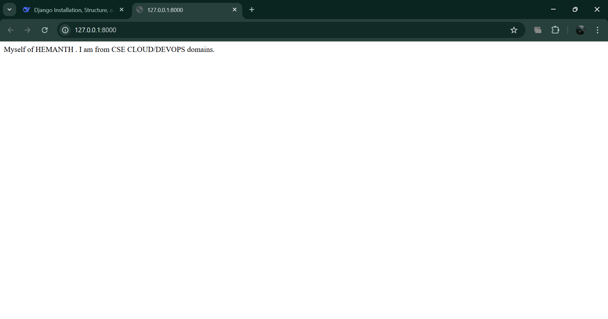
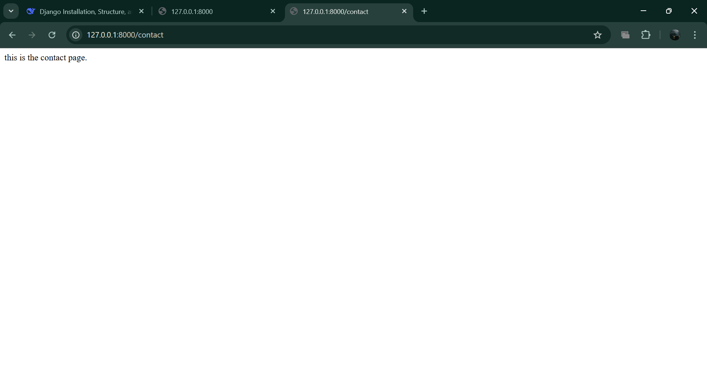

# DAY 3 SAMPLE WORK
1. Today's work is how to use django , how does stark(project) and polls work together to form a website.
### COMMANDS TO START AND INSTALL DJANGO USING UV:
1. Commands & Their Definitions
Command	Purpose
pip install django	==             Installs Django globally using pip.
uv pip install django	==         Installs Django using uv (a faster Python package installer).
python -m django --version	==     Checks the installed Django version.
python manage.py runserver	==     Starts the Django development server.
python manage.py migrate	==     Applies database migrations (creates/updates DB tables).
python manage.py startapp polls	== Creates a new Django app named polls inside the project.
### STRUCTURE OF YOUR PROJECT:
1. stark - mysite name
stark consist of mainly three files which are useful for now:
A) settings.py ==	Contains project settings: DB config, installed apps, middleware, etc.
B) urls.py	   ==   Root URL configuration — maps URLs to views (project-wide).
C) views.py	   ==   Contains view functions/classes that handle requests and return responses.

2. To run our project we have mainly two methods which are combining both polls and mysite using views and urls . Another method is to directly run in on application using only mysite urls and views file . so lets see how it will work :
### First with using polls and mysite(urls and views file):
1. you need to create url file in both polls and mysite and check whether views.py is appeared in bothe the dirs or not , if not create the views.py files in both polls and mysite.
2. So why these files :
A) views.py	: Contains view functions/classes that handle requests and return responses.
B) urls.py 	: You create this to define app-specific URL patterns.
3. Views consist of functions that handles requests: polls/views.py

from django.http import HttpResponse

def contact(request):
    return HttpResponse("this is the contact page.")

def about(request):
    return HttpResponse("Myself of HEMANTH . I am from CSE CLOUD/DEVOPS domains.")

def myname(request):
    return HttpResponse("MY NAME IS HEMANTH")

Here whenever you are using urls path that you given in urls file for these functions it will show you the return output. But now we are doing this in polls/views.py . Now lets see what to do with polls/urls.py file:

4. URLS consist of paths for functions which are useful for connection of polls and mysite also: polls/urls.py

from django.contrib import admin
from django.urls import include, path

urlpatterns = [
    path("admin/", admin.site.urls),
    path('', views.index, name='index'),
    path('contact',views.contact, name='contact'),
    path('about',views.about, name='about'),
    path('myname',views.myname, name='myname'),]

5. Here you can see the paths of contact , about and myname functions. Which means whenever you type localhost:8000/admin or localhost:8000/contact it will show you the output of the return defined in the views.py but polls is not our project directory . So now we need to connect our stark(mysite)

6. To connect your mysite to polls first we will define the same views.py as in the polls for handle functions and in url we will use different :

from django.contrib import admin
from django.urls import path, include
from . import views

urlpatterns = [
    path("admin/", admin.site.urls),
    path('',include("polls.urls")),                       #root which will be shown first when we click our localhost:8000/ 
    path('contact',include("polls.urls")), 
    path('myname',include("polls.urls")),
    path('about',include("polls.urls")),
    
]

7. As you can see the code in the file that represents polls.urls for reference.

8. At last you will get an error which are views not defined in polls/urls.py . So to overcome that error we will use from . import views .
And you need to define polls in installed_apps of stark/settings.py

INSTALLED_APPS = [
    'django.contrib.admin',
    'django.contrib.auth',
    'django.contrib.contenttypes',
    'django.contrib.sessions',
    'django.contrib.messages',
    'django.contrib.staticfiles',
    'polls',
     ]

        

FINAL OUTPUT.

### Second method is using only single directory which is our project dir:
1. The same code that we given in before of views.py will be there because there is no need to change the functions.
2. we need to change the urls path by taking the path that will connect to polls in urls of stark and make it use it own functions itself.

from django.contrib import admin
from django.urls import path, include
from . import views

urlpatterns = [
    path("admin/", admin.site.urls),
    path('index',views.index,name = 'index'),
    path('contact',views.contact,name = 'contact'),
    path('',views.about,name = 'about'),
    path('myname',views.myname, name = 'myname'),
    path('portflio',views.portflio,name = 'portflio'),
    
]

Here urls will take path to stark/views.py for handle the functions.

3. As we know that django is a backend system handler but our project will consist of frontend also . so lets see how to use html and django's.

### USING HTMLS AND CSS FOR WEBSITE:
1. create two dirs in your python-project which is the root directory for your polls and mysite.
A) templates - that consist of html files (index.html,portflio.html).
B) static    - that consist of style.css files.

2. here the paths will not be changed in stark/urls.py but there will be a thing is added is called render:
A) render() is a convenience function in Django that combines three tasks into one:
A)1) Loads an HTML template.
A)2) Renders it with context data (fills in variables).
A)3) Returns an HttpResponse object with the rendered HTML.
Here this render will help you load your html file and renders it with context data:

from django.shortcuts import render
from . import views

def index(request):
    return render(request, 'index.html')

def portflio(request):
    return render(request, 'portflio.html')

And paths will be same for these files as before:

path('index',views.index,name = 'index'),
path('portflio',views.portflio,name = 'portflio'),

3. We need to give a specific hype link to out html to communciate with css which is :
A)


<link rel="stylesheet" href="">

B)
we need to give TEMPLATES DIRS as templates in settings.py
TEMPLATES = [
    {
        'BACKEND': 'django.template.backends.django.DjangoTemplates',
        'DIRS': ['templates'],]

C) 
we also need to give base path:
# Build paths inside the project like this: BASE_DIR / 'subdir'.
BASE_DIR = Path(__file__).resolve().parent.parent
STATIC_URL = '/static/'
STATICFILES_DIRS = [os.path.join(BASE_DIR, 'static')]

