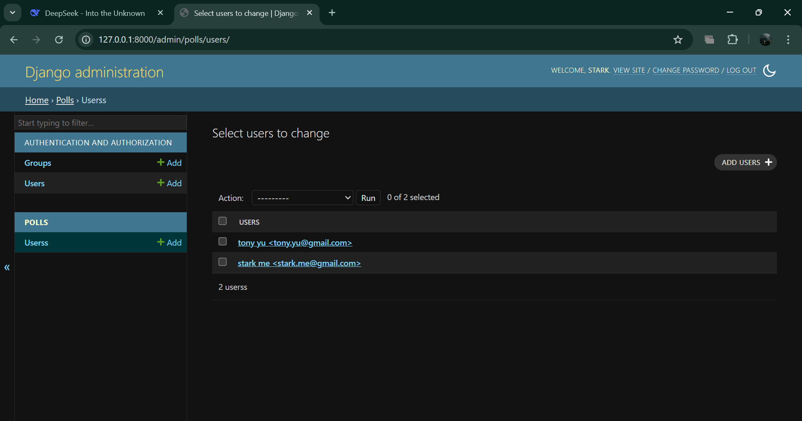
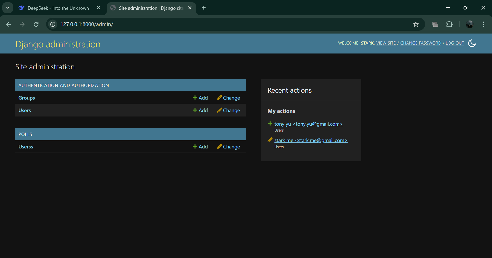
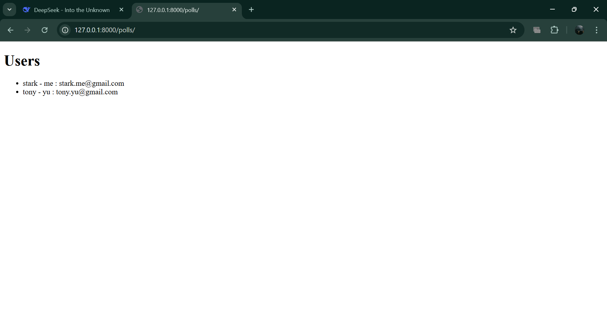

# DAY 8 WORK
### LEARNED ABOUT HOW TO TAKE USER INPUT AND STORE IT IN DATABASE(db.sqilte3)
1. For the first time whenever you use python manage.py migrate a filled will created which is called db.sqilte3 which is our database .
2. For using this and taking inputs we need to create classes and a template in polls which consist of a html script .
### STEPS TO DO THESE
1. Create from the start using django , create a myapp and polls in them .
-> python-admin startproject myapp my-app
-> python manage.py startapp polls
2. create a class in polls/models.py that will take user input but before that make sure your myapp is connected with polls and settings.py has polls defined .

myapp/urls.py = 

from django.contrib import admin
from django.urls import path, include
from . import views
from django.conf import settings
urlpatterns = [
    path("admin/", admin.site.urls),
    path("polls/",include("polls.urls")),

settings.py/myapp = 

INSTALLED_APPS = [
    'django.contrib.admin',
    'django.contrib.auth',
    'django.contrib.contenttypes',
    'django.contrib.sessions',
    'django.contrib.messages',
    'django.contrib.staticfiles',
    'polls',
    'myapp',
]

polls/models.py = 

from django.db import models

# Create your models here.
class users(models.Model):
    first_name = models.CharField(max_length = 30)
    last_name = models.CharField(max_length = 30)
    #address = models.CharField(max_length = 100)
    email = models.EmailField(unique=True)
    #phone_number = models.charField(max_length = 15)
    def __str__(self):
        return f"{self.first_name} {self.last_name} <{self.email}>"

After making changes in models.py use this command:
-> python manage.py makemigrations
This will create a file 0001_initial.py in polls/migrations .
Then using pyhton shell we will give user inputs:
-> pyhton manage.py she;;
>>> from polls.models import users
>>> u = users(first_name = 'stark',last_name = 'me',email = 'stark.me@gmail.com')
>>> u.save()

object relational mapping(orm)

>>> users
<class 'polls.models.users'>
>>> users.objects.all().values()
<QuerySet [{'id': 1, 'first_name': 'stark', 'last_name': 'me', 'email': 'stark.me@gmail.com'}, {'id': 2, 'first_name': 'tony', 'last_name': 'yu', 'email': 'tony.yu@gmail.com'}]>
>>>

3. we will do some changes in polls/admin.py
from django.contrib import admin

# Register your models here.
from .models import users
admin.site.register(users)

which means we registred our models in admin so that we can add users from admin also .

4. Create a template dir in polls and in that create a file user_list.html and create a html script to display the users .

<!DOCTYPE html>
<html>

<body>
    <h1>Users</h1>

    <ul>
        
        <li>{{x.first_name}} - {{x.last_name}} : {{x.email}}</li>
        
    </ul>
</body>
</html>

5. In views of polls we will take the help of render:

from django.http import HttpResponse
from django.template import loader
from .models import users

def index(request):
    myusers = users.objects.all().values()
    template = loader.get_template('user_list.html')
    context = {
        'myusers': myusers,
        
    }
    return HttpResponse(template.render(context, request))

6. finally give a path in polls/urls.py for getting website .

from django.urls import include, path
from . import views

urlpatterns = [
    # path("admin/", admin.site.urls),
    path('',views.index,name = "index"),
]

7. need to decleare the template in our myapp/settings.py templates:

TEMPLATES = [
    {
        'BACKEND': 'django.template.backends.django.DjangoTemplates',
        'DIRS': ['polls/template'],
        'APP_DIRS': True,
        'OPTIONS': {
            'context_processors': [
                'django.template.context_processors.request',
                'django.contrib.auth.context_processors.auth',
                'django.contrib.messages.context_processors.messages',
            ],
        },

8. -> python manage.py migrate
-> python manage,py runserver

